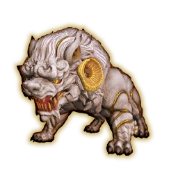

# Beast Keeper

A Dalamud plugin for **Beastmaster** in FINAL FANTASY XIV.

Before every battle in the **Crucible of the Unbroken**, the game makes you assign three familiars to your
battlehorns all over again. Beast Keeper does it for you the moment the Team Composition window opens: it
remembers your team, or simply picks the first three familiars in your roster.

## Features

- **Remembers your team.** The familiars on your battlehorns in the previous battle are set again, in the same
  order. Change them by hand and the new team is remembered.
- **Or picks the first three** familiars in your roster, every time.
- **Fresh team each run.** The remembered team is cleared when you start a new run; the team you commence your
  first battle with is used for the rest of that run.
- **Handles knocked-out familiars.** A knocked-out familiar is replaced from your roster for that battle and comes
  back once it has recovered.
- **Optional auto-commence.** When you enter a run you're asked whether battles should start automatically. It never
  does on the first battle of a run, when a familiar had to be replaced, or with fewer than three familiars.

## Installation

1. In game, type `/xlsettings` and open the **Experimental** tab.
2. Under **Custom Plugin Repositories**, add the link below, tick **Enabled**, and click **Save and Close**.
   ```
   https://raw.githubusercontent.com/Kyuros1/BeastKeeper/main/repo.json
   ```
3. Type `/xlplugins`, search for **Beast Keeper**, and install it.

## Usage

Open the settings with `/bk`, or from the plugin installer.

| Command | What it does |
| --- | --- |
| `/bk` | Open settings |
| `/bk on` / `/bk off` | Turn automatic battlehorns on or off |
| `/bk mode last` / `/bk mode first` | Remember my last team / first three in roster |
| `/bk assign` | Set battlehorns now, while the Team Composition window is open |
| `/bk forget` | Forget the remembered team |
| `/bk commence on` / `/bk commence off` | Start battles automatically for the rest of this run |

## Building from source

Requires the [.NET 10 SDK](https://dotnet.microsoft.com/download) and XIVLauncher with Dalamud installed.

```
dotnet build -c Release
```

To try a local build, add `BeastKeeper/bin/Release/BeastKeeper.dll` under **Dev Plugin Locations** in
`/xlsettings` → **Experimental**, then enable it in `/xlplugins` → **Dev Tools**.

## License

Copyright © 2026 Kyuros1. Beast Keeper is free software, licensed under the
[GNU Affero General Public License v3.0](LICENSE).
